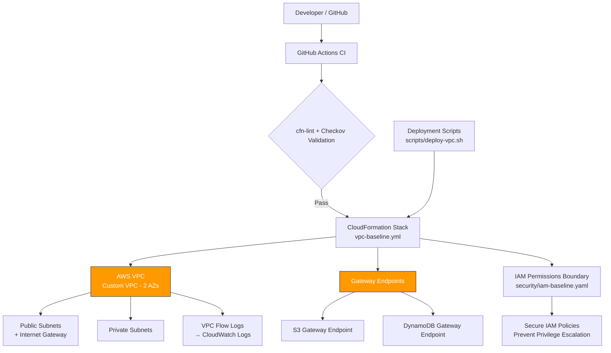

# Platform Foundation – AWS Baseline IaC

Production-grade AWS foundation templates (VPC + IAM boundary) built with CloudFormation.

Goal: Create a secure, repeatable, cost-aware starting point for serverless/container workloads while staying within AWS Free Tier / learning credits constraints.

## Current Components

- **Networking**  
  Custom VPC (2 AZs), public + private subnets, Internet Gateway, VPC Flow Logs (CloudWatch), Gateway Endpoints (S3, DynamoDB)

- **Security**  
  Permissions boundary policy for compute roles (Lambda, ECS Fargate, etc.) with explicit Deny rules for privilege escalation

- **CI Validation**  
  GitHub Actions workflow running:
  - `cfn-lint` (syntax & best practices)
  - `checkov` (security & compliance scanning)

 ## 🏗️ Architecture



## Repository Structure

```text
.
├── .github/workflows/
│   └── validate-cloudformation.yml     # CI quality & security gate
├── scripts/
│   ├── deploy-vpc.sh                   # Helper to deploy VPC stack
│   ├── teardown.sh                     # Clean up stack
│   └── lint.sh                         # Local validation (cfn-lint + checkov)
├── templates/
│   ├── networking/
│   │   └── vpc-baseline.yml
│   └── security/
│       └── iam-baseline.yaml
└── README.md
```

## Quick Start (Local)

1) ### Prerequisites
AWS CLI configured
Python + pip (for validation tools)

2) ### Validate templates locally
   ```./scripts/lint.sh```
3) ### Deploy VPC baseline
   ```./scripts/deploy-vpc.sh```
4) ### Verify (examples)
   ```aws cloudformation describe-stacks --stack-name vpc-dev```
   ```aws ec2 describe-subnets --filters "Name=tag:Name,Values=vpc-dev-*"```
5) ### Destroy when finished (important – to avoid costs)
   ```./scripts/teardown.sh```

### Cost Awareness

- VPC, subnets, IGW, gateway endpoints → $0
- Flow Logs (minimal traffic) → usually within free tier
- SSM/ECR interface endpoints → ~$0.01–0.02/hour per AZ (destroy stack after use)
- KMS key (if added) → ~$1/month

→ Always destroy stacks when not actively learning/testing.
### Security Posture Notes

- Permissions boundary prevents privilege escalation
- Flow Logs enabled for troubleshooting & auditing
- Checkov security scan enforced in CI

### Future Extensions (planned)

- NAT Gateway / private subnet outbound (when needed)
- Lambda / ECS Fargate test workload using boundary
- Parameter files per environment
- CloudFormation drift detection
- Cost allocation tags
- More VPC endpoints (Secrets Manager, API Gateway, etc.)

License
MIT
👤 Author
Oluwa-feranmi
Platform & Cloud Engineering Enthusiast | SRE | DevOps Engineer

GitHub: @Oluwa-feranmi

Last updated: March 2026
